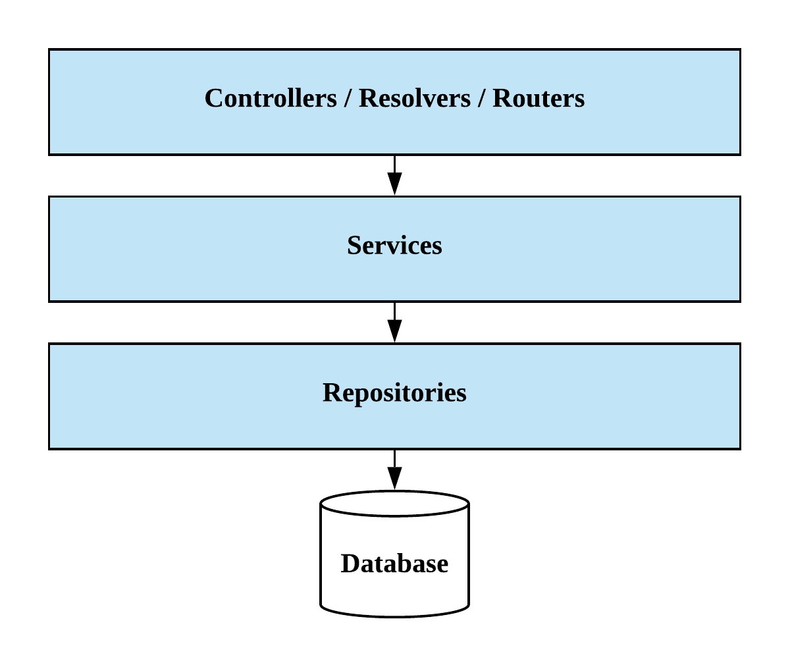
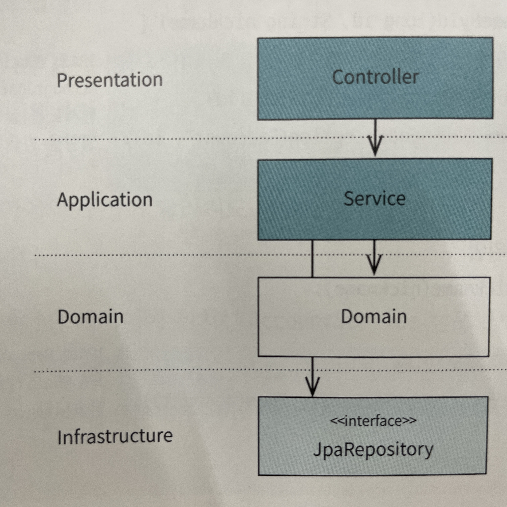
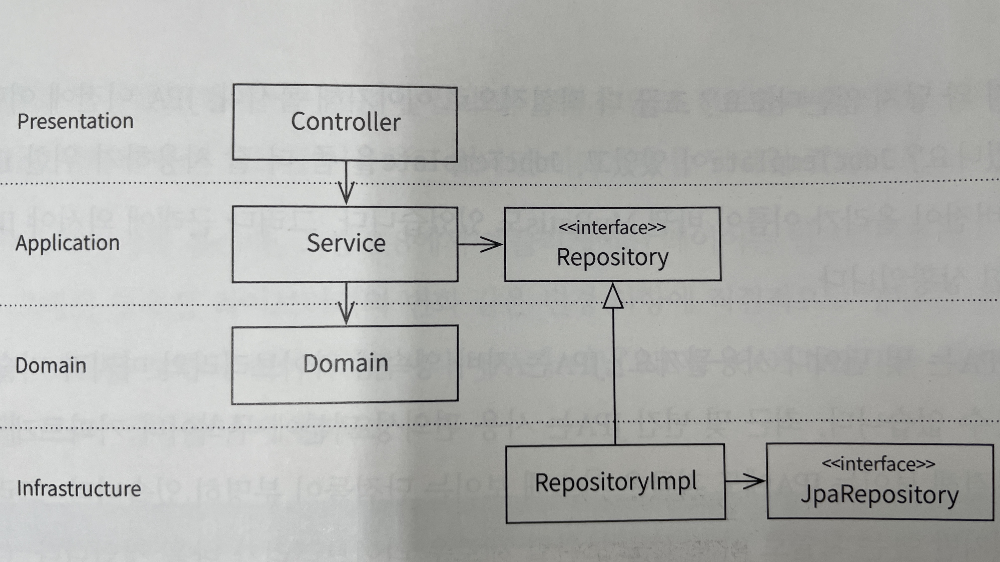
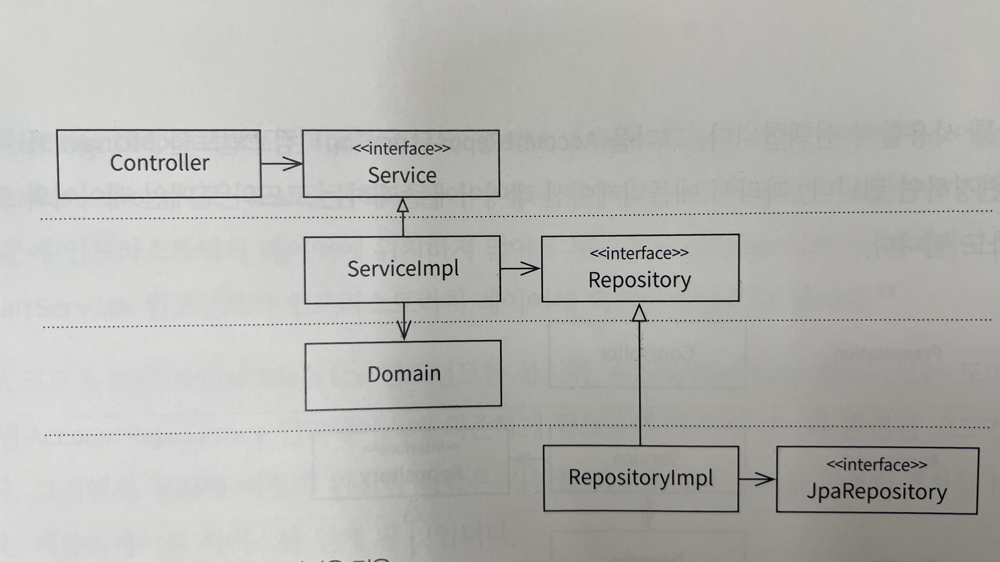

# 레이어드 아키텍쳐

레이어드 아키텍처를 스프링 컴포넌트를 분리하는 정도로 생각한다면, 그것은 폴더 구조일 뿐이다.

레이어드 아키텍쳐를 제대로 사용하려면 아래 3개의 제약조건을 지켜야 한다.
- 레이어 구조를 사용한다.
- 레이어 간 의존 방향은 단방향으로 유지한다.
- 레이어 간 통신은 인접한 레이어에서만 이루어지게 한다.

아키텍쳐라는 말에서 이미 제약조건의 개념을 찾을 수 있다.
아키텍쳐는 정책과 제약조건을 이용하여 목적을 달성하는 것이며, 문제가 발생하는 것을 차단한다.

다른 말로, 제약조건은 목적을 달성하기 위해 존재하는 것이다.
- 따라서 제약조건은 목적에 따라 달라질 수 있다.
- 따라서 목적이 다른 두 프로젝트는 아키텍쳐가 달라질 수 있으며, 레이어드 아키텍쳐를 어떻게 적용할 지도 달라질 수 있다.

하지만 아무리 적어도 다음 2가지 제약조건을 지켜야 한다. (처음 예시의 마지막 제약조건이 빠진 형태, 완화된 레이어드 아키텍쳐에 해당)
- 레이어 구조를 사용한다.
- 레이어 간 의존 방향은 단방향으로 유지한다.

## 잘못된 레이어드 아키텍쳐 인식
레이어드 아키텍쳐에 대해 흔히 하는 잘못된 인식이 레이어드 아키텍쳐가 다음과 같다는 것이다.

이러한 잘못된 인식을 가지면, Controller, Service, Repository, Entity와 같은 스프링 컴포넌트에 의존하는 아키텍쳐에 대해 고민하게 된다. 아키텍쳐에 대해 이렇게 정의를 내리면 각 레이어의 목적은 모호한데, 레이어의 실체는 구체적인 문제가 발생한다. (기계적인 레이어 나누기)

## 잘못된 레이어드 아키텍쳐 접근들

이제 한번 레이어드 아키텍쳐를 적용하면서 스프링 프로젝트를 만들어보자. 무엇부터 만들 것인가?

### JPA Entity 우선접근
@Entity가 붙은 객체를 먼저 만드는 경우 해당한다.

@Entity가 붙은 객체는 DDL로 변환되어 데이터베이스가 된다. 즉, JPA Entity를 먼저 만든다는 것은 **데이터베이스를 먼저 만든다**는 의미이다.

이러한 접근은 다음과 같은 이유에서 좋지 않다.
- 데이터 위주의 사고를 유도한다.
- 절차지향적인 사고를 유도한다.
- 소프트웨어 개발 과정에서 **데이터베이스가 깊이 관여**한다.

### API Endpoint 우선접근

JPA Entity 우선접근 방식보다는 나은 면이 있다. 바로 요구사항을 파악하게 만든다는 점이다. 하지만 애석하게도 이 방식은 **특정 프레임워크에 의존**하게 만든다.

기술스펙은 요구사항을 분석한 후, 해결수단으로 선택되어야 하는 것이지, 이렇게 먼저 선택되어야 하는 것이 아니다.

따라서 이 방법도 객체지향적인 코드를 작성하는데 도움이 되지 않는다.

## 어떻게 해야 할까?

객체지향적으로 개발하기 위해서는 먼저 **풍성한 도메인 객체**를 만들어야 한다. 따라서 첫 단추는 도메인 객체를 만드는 것이다.

그렇다면 도메인 객체는 어디에 만들면 되는걸까? Presentation 레이어도 아니고, Infrastructure 레이어도 아니었으니 이제 남은것은 Business 레이어이다. 그렇다 Business 레이어부터 시작하면 된다.

잠시만, Business 레이어는 @Service 컴포넌트가 위치하는 곳이 아니었나? 혼동이 온다. Business 레이어는 서비스 컴포넌트만이 위치하는 곳이 아니다. 도메인도 같이 포함한다.

하지만 이렇게 Business 레이어에 두 역할이 공존하니, 애플리케이션의 핵심인 도메인이 묻히게 된다. 따라서 도메인을 중시하는 개발자는 **도메인 계층**을 따로 두기도 한다.

이 도메인 계층은 객체지향적인 도메인 모델들이 활동하는 공간이다. 도메인 모델들은 순수 자바 객체로 작성되며, 외부 라이브러리에 의존하지 않는다.

또한 비즈니스 계층에서 도메인 모델이 분리됨에 따라, 비즈니스 계층을 애플리케이션 계층이라고 부르게 된다. (비즈니스 레이어 = 애플리케이션 레이어 + 도메인 레이어) 또한 이렇게 되면 애플리케이션 계층의 서비스는 도메인에 있는 코드를 실행하는 역할을 하게 된다. 이것은 서비스가 비즈니스 서비스 파사드로 작동하게 되는 것이며, 매우 얇은 서비스를 만들 수 있게 된다. (얇은 서비스와 풍부한 도메인은 항상 옳다.)

다시 강조하자면, 도메인 계층은 순수 자바 코드로 작성되어야 한다. JPA같은 외부 라이브러리에 종속되면 안된다. 이렇게하면 도메인 모델이 독립적으로 먼저 구축될 수 있으며 풍부해질 기회가 늘어나기 때문이다.

## JPA와의 안녕

지금까지 얘기해온 레이어드 아키텍쳐에는 한가지 큰 문제점이 있다.

바로 애플리케이션 레이어에서 JPA와 강결합되어 있다는 것이다. 이렇게 기술에 의존하는 레이어가 있다면, 기술이 변경되었을 때 애플리케이션 레이어도 함께 변경되어야 한다. 이는 유연하지 못한 설계이다.

이 문제를 해결하기 위해서는 애플리케이션 레이어에서 JPA를 분리해야 한다. 어떻게 분리할 수 있을까?

사실 우리는 이 전의 장들에서 그 방법을 배웠다. 바로 **의존성역전**을 사용하는 것이다.

Repository 순수 자바 인터페이스로 작성되어 있으며 서비스는 해당 인터페이스만에 의존한다. 이 인터페이스의 구현체로는 JPA를 사용한 RepositoryImpl이 주입되게 된다.

이렇게 하면 장점이 하나 더 있다. 원래는 엔티티 객체를 도메인 객체로 변환하는 코드를 서비스에 넣어야 했지만, 이제는 RepositoryImpl에서 수행하면 된다. Repository, Service는 모두 엔티티 객체가 아니라 도메인 객체만을 의존하게 된다.

## 웹 프레임워크와 안녕

JPA와 분리되었던 것과 같이 웹 프레임워크도 분리할 수 있다. 분리된 모습은 다음과 같다.

하지만 이 아키텍쳐에 대해서는 두 의견이 있다.

### 좋다는 의견
- 기존보다 조금 더 유연해졌다.
- 헥사고날 아키텍쳐가 되었다.
- 프레젠테이션 레이어 테스트가 쉬워진다.

### 안좋다는 의견
- 실효성이 없다.
- 우리의 애플리케이션은 이미 충분히 유연하다.
  - 웹 애플리케이션이 아니라 다른 애플리케이션으로 만들게 된다고 하더라도, 컨트롤러만 체하면 되기 때문이다.
- 애플리케이션 계층이 변경될 때 의미가 있는 변경인데, 애플리케이션 계층이 바뀔일은 없다.

## 마치며

지금까지 레이어드 아키텍쳐에 대해서 논했지만, 처음에 말했듯이 아키텍쳐는 목적을 이루기 위한 제약조건이다. 우리의 목적을 먼저 판단해야 한다.

TODO 앱 정도를 만들 때는 굳이 이런 복잡한 아키텍쳐를 적용할 필요가 없다. 오버엔지니어링이다.

꼭 목적을 먼저 명확히 하고, 그 목적을 달성하기 위한 아키텍쳐를 고민하자.