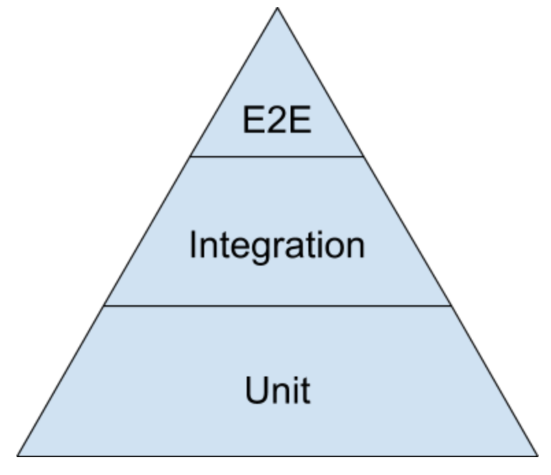
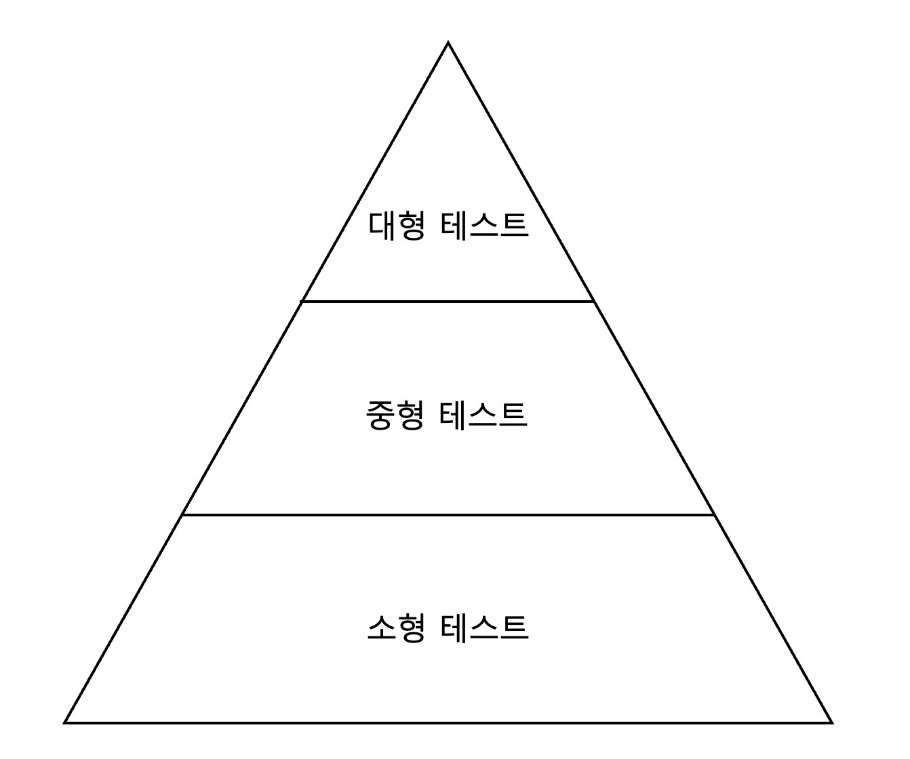

# 13장 테스트 피라미드

## 고전적 테스트 피라미드

- 테스트 피라미드는 다음 3개의 계층으로 나뉜다.
  - **E2E 테스트** : End to End, 실제 사용자 입장에서 어떻게 작동하는지 테스트한다. 백엔드 관점에서는 API 테스트가 이에 해당한다.
  - **통합 테스트** : 여러 컴포넌트가 상호작용하는 것을 테스트한다. 흐름을 테스트하게 되는 것이다.
  - **단위 테스트** : 한 컴포넌트에 할당된 책임이 잘 완수되는지 테스트한다.
- 테스트 피라미드는 이렇게 테스트를 분류할 뿐만 아니라, 테스트 분류간의 비율도 말해준다. 풍부한 단위 테스트와 이를 묶어주는 통합 테스트, 그리고 몇몇의 E2E 테스트의 비율을 권장한다.
- 또한 선행 관계도 표현한다. 단위 테스트부터 E2E 테스트로 테스트를 쌓아가야 한다.
  - 도메인 주도 개발에 컨트롤러와 도메인이라는 개념이 존재한다.
    - 도메인 : 비즈니스 로직을 담고 있는 도메인 코드
    - 컨트롤러 : 여러 도메인을 부르고 외부 의존성과 상호작용하는 코드
  - 이런 도메인은 단위 테스트로 테스팅할 수 있고, 컨트롤러는 통합 테스트로 테스팅할 수 있다.
  - 즉, **단위 테스트는 도메인 테스트**이고, 그 때문에 단위 테스트가 중요한 것이다.
- 하지만 이런 3개의 분류가 헷갈릴 수 있다. 
  - 헷갈리기 때문에, 분류하는 의의가 사라진다.
  - 따라서 구글은 다른 분류를 제안했다.

## 구글의 테스트 피라미드

- 구글의 테스트 피라미드는 다음 3개의 계층으로 나뉜다.
  - **대형 테스트** : 멀티 스레드/멀티 프로세스/멀티 서버를 사용하는 코드를 테스트 
  - **중형 테스트** : 멀티 스레드/멀티 프로세스를 사용하는 코드를 테스트
  - **소형 테스트** : 싱글 스레드를 사용하는 코드를 테스트
- 구글이 테스트 피라미드를 이렇게 나눈 이유는 무엇일까?
  - 구글은 다음 두가지 기준을 제시한다.
    - **테스트는 결정적이어야 한다.**
    - **테스트는 빨라야 한다.**
  - 우리가 스프링 프로젝트를 테스트할 때를 생각해보자.
    - @SpringBootTest같은 애노테이션을 붙이고 H2DB을 올려서 테스트한다.
    - @SpringBootTest -> 스프링을 띄워야 하므로 속도가 매우 느려진다.
    - H2DB -> DB는 모든 테스트에서 공유된다. 따라서 테스트가 비결정적이게 된다.
    - 이런 테스트는 소형 테스트가 아닌 것이다. 느리고 비결정적이다.
  - 구글의 소형테스트 기준은 싱글 스레드를 사용하기 위해서가 아닐 수 있다. 오히려 그것은 결과이다.
    - 빠르고 결정적인 테스트를 만들다 보면 싱글 스레드를 사용하게 된다.
- 따라서 구글의 테스트 피라미드 분류는 다음과 같이 바뀔 수 있다.
  - 대형 테스트 : 외부 서버와 통신해야 하는 테스트 (느리고 비결정적)
  - 중형 테스트 : 블로킹 호출이나 디스크 I/O가 필요한 테스트 (약간 느리고 비결정적)
  - 소형 테스트 : 병렬로 실행할 수 있으며, POJO로 짜인 테스트 (빠르고 결정적)

## 소형(단위)테스트는 왜 중요한가?
- 단위 테스트가 도메인 테스트이기 때문에 중요할 수 밖에 없다. (도메인 로직을 테스트하기 때문)
- 또 다른 이유로는, 테스트코드가 프로덕션 코드를 테스팅할 뿐만 아니라, 더 좋게 만들어준다는 점에 있다.
  - 단위 테스트를 중요시하면 컨트롤러와 도메인의 역할이 명확하게 나뉜다.
  - 스프링으로 예를 들면, 서비스에 있던 로직들을 도메인 객체로 넘기면서 트랜잭션 스크립트가 사라지는 현상과 비슷하다.
  - 따라서 **객체 지향적인 코드를 짤 수 있다.**
- 또한 단위 테스트는 테스트 비용이 매우 작다.
  - 여러번, 빠르게, 결정적으로 테스팅할 수 있다. (비용감소)
  - **개발하고 있는 코드에 대한 피드백을 매우 빠르게 받을 수 있다.** (TDD)
  - **리팩터링하고 있는 코드에 대한 피드백을 매우 빠르게 받을 수 있다.** (회귀방지)

## 왜 통합 테스트는 단위 테스트보다 덜 필요한가?
- 통합 테스트는 비결정적이다.
  - Docker로 띄운 MySQL을 실수로 껐다면?
  - 외부 메시지버스가 작동하지 않는다면?
- 따라서 통합 테스트는 단위 테스트에 비해 깨지기 쉽다.
- 여기서 문제점은 코드는 문제가 없는데, 테스트가 깨지기 쉽다는 것이다.
- 개발자는 다음과 같은 생각을 하게 된다.
  - 테스트가 깨졌네? 코드에 손을 대기가 너무 무서워.
  - 테스트가 또 깨졌네? 그냥 무시할래.
- 이런 현상이 지속되면 전체 테스트 스위트의 효용가치가 떨어지고, 테스트는 짐덩이가 된다.
- 따라서 단단한 단위 테스트를 좀 더 많이 짜야하는 것이다.
- 기억하자, **코드는 자산이 아니라 책임이다.**